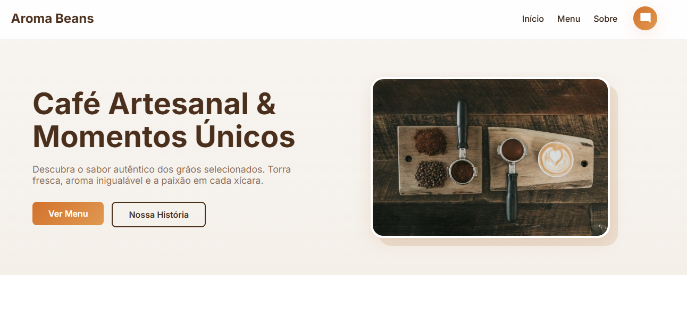

# Chatbot Aroma Beans
<br/>
<br/>
<p align="center">
  
  
  
  
</p>
<br/>

<br/>
<br/>

## Download
<p align=>
  <strong>Código:</strong> <a href="https://github.com/boosa515/Chatboot/archive/refs/heads/main.zip"><strong>Clique Aqui (Código-Fonte)</strong></a>
</p>

<br/>

## 💡 Sobre o Projeto

Assistente virtual inteligente desenvolvido em **React** com **Vite**, criado para a cafeteria fictícia **Aroma Beans**.

O principal diferencial é a integração com a **API do Google Gemini**, que fornece ao chatbot uma personalidade de barista especialista, capaz de sugerir harmonizações e responder dúvidas sobre o cardápio. A aplicação é uma **SPA (Single Page Application)** completa, com navegação fluida e design temático responsivo.
<br/>
<br/>

## ⚙️ Principais Funcionalidades

* **IA Generativa:** Chatbot integrado ao Google Gemini 1.5 Flash, configurado com instruções de sistema personalizadas (Persona de Barista).
* **Navegação SPA:** Sistema de rotas (Home, Menu, História) utilizando `react-router-dom` sem recarregamento de página.
* **Interface Temática:** Design System próprio baseado em tons de café (Espresso e Cobre), com componentes visuais como Cards e Botões estilizados.
* **Scroll Inteligente:** Funcionalidade de "Scroll To Top" automática ao navegar entre as páginas.
* **Formatação Rica:** O chat processa e formata automaticamente as respostas da IA (negrito, listas) para melhor leitura.
* **Responsividade:** Layout totalmente adaptável para dispositivos móveis e desktops.

<br/>
<br/>

## Pré-requisitos

* Node.js (v18 ou superior)
* Chave de API do Google Gemini (AI Studio)

<br/>
<br/>

## Project Screen

<div align="center">
  
</div>

# 1. Configurar o Ambiente

  Configure a API Key Crie um arquivo .env na raiz do projeto e adicione sua chave:

  ```bash
VITE_API_URL=[https://generativelanguage.googleapis.com/v1beta/models/gemini-1.5-flash:generateContent?key=SUA_CHAVE_AQUI]
```
<br/>
<br/>

